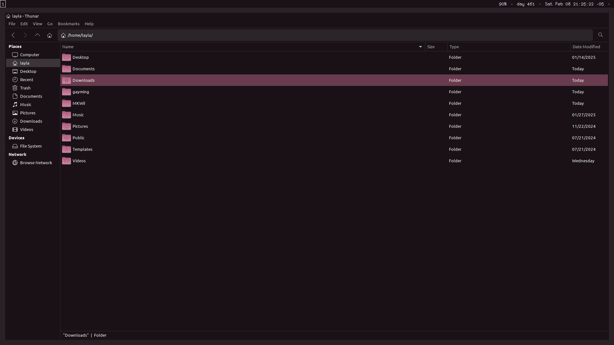

## Colloid-layla icon theme

this is a fork of [Colloid icon theme](https://github.com/vinceliuice/Colloid-icon-theme) which replaces the default color scheme with my own color scheme

### screenshot



## Install tips

Usage:  `./install.sh`  **[OPTIONS...]**

```
-d, --dest DIR          Specify destination directory (Default: $HOME/.local/share/icons)
-n, --name NAME         Specify theme name (Default: Colloid-layla)
-s, --scheme VARIANTS   Specify folder colorscheme variant(s) [default|nord|dracula|gruvbox|everforest|catppuccin|all]
-t, --theme VARIANTS    Specify folder color variant(s) [default|purple|pink|red|orange|yellow|green|teal|grey|all] (Default: blue)
-notint, --notint       Disable Follow ColorSheme for folders on KDE Plasma
-h, --help              Show help
```
> For example: install teal nord version -> run: `./install.sh -s nord -t teal`

> For more information, run: `./install.sh -h`
